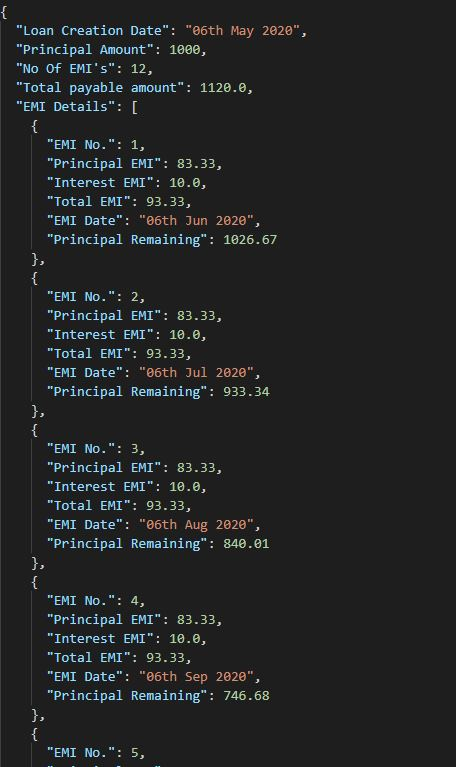

## 91social Backend Assignment

To run this program in the command line, simply write  
<code>python loan.py <principal_amt> <num_of_emi> <interest_rate_per_anum></code>

There are 3 essential arguments to this line. (Even though the assignment asks for 2. The assignment assumes a fixed interest rate, but here I have given the option to change interest rate as well) 
The first one is <b>principal_amt</b> which refers to the loan amount taken from the bank. 
The second is <b>num_of_emi</b> which refers to the number of EMIs that the customer has opted for. For eg., if the customer wants to take a loan for 6 months, then he has to pay 6 months of EMI. If a customer wants to take a loan for 1.5 years, then he has to pay 18 months of EMI. 
The third one is <b>interest_rate_per_anum</b> which simply is the annual interest rate of the loan.

### Optional Paramters

If you want to create a json file for the output, you can add the paramter: <code>-o "<output_file_path>"</code> after giving the 3 essential parameters.
A sample command will be: 

<code>python .\loan.py 1000 12 12 -o "sample.json"</code>

### Function Descriptions
For loan.py  

tojsonfile() 
Converts the output dictionary to a downloadable json file in the specified path.

Class loan_management 

<ul>
<li>__init__()</li>
Constructor to instantiate the variables for calculations. Since the input to the python script is principal_amt, num_of_emi and interest_rate_per_anum, these 3 parameters will be fed to the constructor while initializing the class object.

<li>emi_calc()</li>
This is to calculate principal_emi, interest_emi and total_emi. Return all the aforementioned.

<li>calc_for_duration()</li>
Returns a dictionary where along with the basic details of loan, details about EMI for each month is also present.
</ul>

Sample output of program: 
